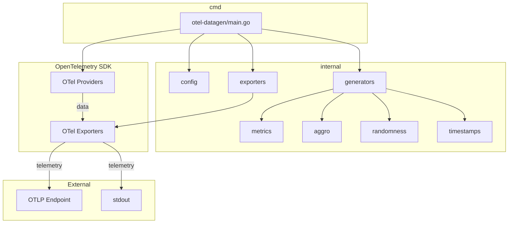
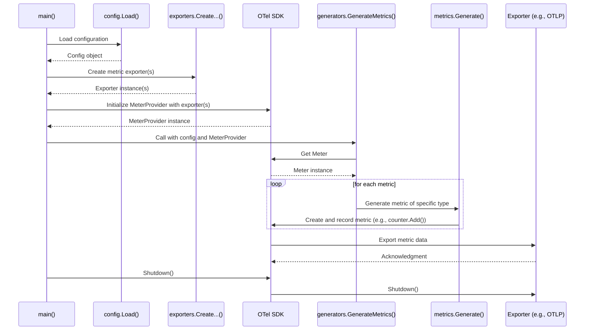

# Codebase Analysis for otel-datagen

This LLM-genrated document provides a description of the `otel-datagen` codebase, including its modules, their implementation, and a diagram of the execution flow.

## 1. Module Breakdown

The codebase is organized into several key directories:

- **`cmd/otel-datagen`**: The main entry point of the application. It handles command-line argument parsing and orchestrates the overall execution flow.
- **`internal`**: Contains the core logic of the application, separated into several packages:
  - **`aggro`**: Implements "aggressive" data generation, likely for stress-testing purposes, using a list of "naughty strings" (`blns.txt`).
  - **`config`**: Manages application configuration, including parsing command-line flags.
  - **`exporters`**: Provides a factory for creating OpenTelemetry exporters (OTLP and stdout).
  - **`generators`**: Contains the logic for generating logs, metrics, and traces.
  - **`metrics`**: Implements the generation of specific metric types (counters, gauges, histograms, etc.).
  - **`randomness`**: Provides utilities for generating random data, with specific functions for Antithesis integration.
  - **`timestamps`**: Contains logic for calculating and manipulating timestamps.
- **`antithesis`**: Contains files related to running the application in an Antithesis testing environment, including Docker configurations and test drivers.
- **`specs`**: Contains product requirement documents (PRDs) and task lists for different features and refactoring efforts.

## 2. Core Components

### `cmd/otel-datagen`

The `main.go` file serves as the application's entry point. It initializes the configuration, sets up the OpenTelemetry exporters and providers, and then calls the appropriate generator functions based on the command-line arguments.

### `internal/config`

The `config.go` and `flags.go` files define the application's configuration structure and the command-line flags used to populate it. The `Load()` function in `config.go` is responsible for parsing these flags and returning a populated `Config` struct.

### `internal/generators`

This package contains the primary logic for generating telemetry data. The `logs.go`, `metrics.go`, and `traces.go` files contain functions that create and emit OTel data based on the provided configuration.

### `internal/metrics`

This package provides the specific implementations for generating different types of metrics. Each file (e.g., `counters.go`, `gauges.go`) corresponds to a different metric instrument. The `Generate` function in `metrics.go` acts as a dispatcher, calling the appropriate function based on the `metricType` parameter.

### `internal/exporters`

The `factory.go` file contains functions for creating and configuring OTel exporters. It supports both OTLP (gRPC and HTTP) and stdout exporters, and can create "dual" exporters to send data to both a console and an OTLP endpoint simultaneously.

## 3. Execution Flow

The application follows a clear execution path:

1.  **Initialization**: The `main` function in `cmd/otel-datagen/main.go` is called.
2.  **Configuration Loading**: `config.Load()` is called to parse command-line flags and create a `Config` object.
3.  **Exporter Creation**: The `exporters` package is used to create the necessary OTel exporters based on the configuration.
4.  **OTel SDK Setup**: The OTel `TracerProvider`, `MeterProvider`, and `LoggerProvider` are created and configured with the exporters.
5.  **Generator Selection**: Based on the configuration, the appropriate function from the `generators` package is called (e.g., `GenerateLogs`, `GenerateMetrics`, `GenerateTraces`).
6.  **Data Generation**: The selected generator function enters a loop to create the specified number of telemetry items. For metrics, this involves calling the `metrics.Generate` function, which in turn calls the specific metric generation function.
7.  **Data Export**: The generated telemetry data is passed to the configured exporters, which then send it to the specified destination (console or OTLP endpoint).
8.  **Shutdown**: Once the generation is complete, the OTel providers are shut down gracefully.

## 4. Diagrams

### Component Diagram

### Sequence Diagram (Metric Generation)

